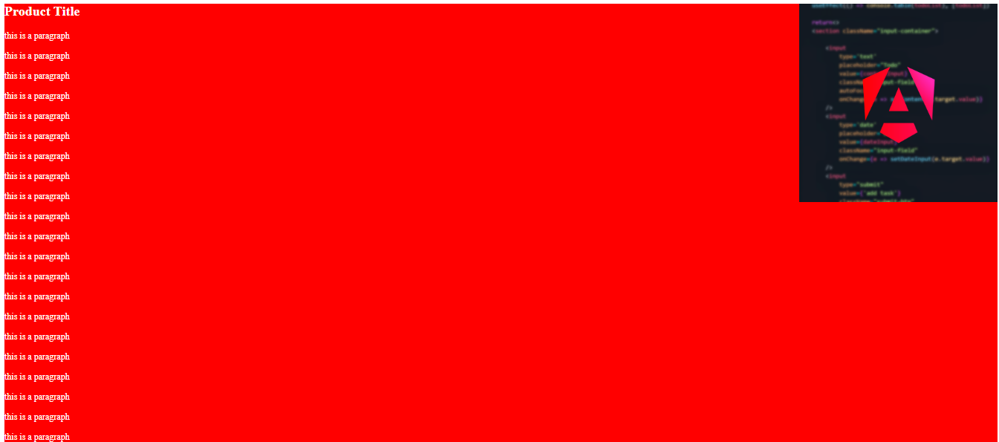
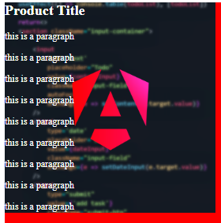

<!-- @format -->

# Background:

- [background color](#background-color)
- [background image](#background-image)
- [background repeat](#background-repeat)
- [background attachment](#background-attachment)
- [background position](#background-position)
- [background size](#background-size)

---

for this sections below, will be using this html code:

```html
<div class="">
	<h2>Product Title</h2>
	<p>this is a paragraph</p>
	<p>this is a paragraph</p>
	<p>this is a paragraph</p>
	<p>this is a paragraph</p>
	<p>this is a paragraph</p>
	<p>this is a paragraph</p>
	<p>this is a paragraph</p>
</div>
```

## background-color:

with the `background-color` property you can set a color for the element's background.

```css
background-color: color-name | rbg | rgba | #hex;
```

for instance:

```css
div {
	background-color: red;
}
```


---

## background-image:

with the `background-image` you can set the element's background to be an image using the `url` function, a gradient using `linear/radial gradient`, etc...

```css
div {
	background-color: red;
	background-image: url("/MyProfilePic.png");
}
```


---

## background-repeat:

as shown in the previous section, css will repeat the background image if provided to fill the element, this behavior can be controlled with `background-repeat`.

```css
background-repeat: repeat /*default*/ | repeat-x /*only repeat horizontally*/ |
	repeat-y /*only repeat vertically*/ | no-repeat; /*never repeat the image even if it is smaller than the element*/
```

```css
div {
	background: red;
	background-image: url("/MyProfilePic.png");
	background-repeat: no-repeat;
}
```


---

## background-attachment:

the `background-attachment` allows you to control the behavior of the background on scroll.

by default it's `scroll` meaning that the background image will move when scrolling.

another option is `fixed` which means that the image will not move when scrolling.

```css
background-attachment: scroll | fixed;
```

---

## background-position:

the `background-position` allows you to move the background to a certain position or offset it.

```css
background-position: top | bottom | right | left | center;

background-position: {top | bottom | center} {right | left | center };

background-position: offset;

background-position: offset-x offset-y;
```

```css
div {
	color: white;
	background: red;
	background-image: url("/MyProfilePic.png");
	background-position: top right;
}
```



---

## background-size:

the `background-size` allows you yo control the size of the background.

```css
background-size: size;
background-size: size-x size-y;
```

```css
div {
  color: white;
  background: red;
  background-image: url("/MyProfilePic.png");
  background-repeat: no-repeat;
  background-size: 20%;
}
```

