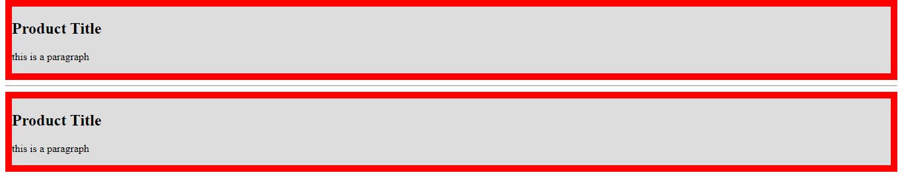

<!-- @format -->

# Border:

the `border` allows you to add a border around the element outside the padding space.

you can control the thickness with `border-width`, color with `border-color` and style with `border-style`, or just use `border` as faster way

```css
border-with: value; /*all around*/
border-width: top right bottom left;

border-color: color; /*all around*/
border-color: top right bottom left;

border-style: dotted | solid | wavy | dashed | etc...;
/*also can use 4 value for top right bottom left in order*/
```

> [!NOTE]  
> all these properties can be set for a specific side using border-{top | left | bottom | right}-{property}

```css
border: thickness style color;
```

---

```html
<div class="div1">
	<h2>Product Title</h2>
	<p>this is a paragraph</p>
</div>
<hr />
<div class="div2">
	<h2>Product Title</h2>
	<p>this is a paragraph</p>
</div>
```

```css
.div1 {
	background: #ddd;
	border-width: 10px; /*border thickness*/
	border-color: red; /*top right bottom left*/
	border-style: solid;
}

.div2 {
	background: #ddd;
	border: 10px red solid;
}
```

