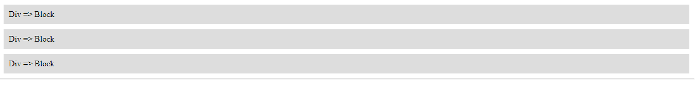

<!-- @format -->

# Display:


## block:

a block element is by default something like a `div`.

block elements:

- default width is the full width of the parent
- adds line breaks before and after the element
- respects padding & margins, width & height

---

```html
<div>Div => Block</div>
<div>Div => Block</div>
<div>Div => Block</div>
```

```css
div {
	display: block;
	background: #ddd;
	padding: 10px;
	margin: 10px;
}
```



---

## inline:

inline elements like `span` are completely different.

inline elements:

- width is set by the content can't be overwritten
- no line-break
- doesn't respect width & height, but respects padding & margins horizontally only

---

```html
<span>Span => inline</span>
<span>Span => inline</span>
<span>Span => inline</span>
```

```css
span {
	background: #eee;
	width: 1000000px;
	padding: 20px;
}
```


---

## inline block:

inline-block elements are a mix of `inline` & `block` elements.

inline-block:

- allows element to be before & after it
- respects width & height, margin & padding

---

```html
<section>Section => inline-block</section>
<section>Section => inline-block</section>
<section>Section => inline-block</section>
```

```css
section {
	display: inline-block;
	background: #636363;
	width: 400px;
}
```


