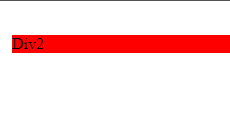

<!-- @format -->

# Element visibility:

html used through out this file

```html
<div class="div1">Div1</div>
<div>Div2</div>
```

```css
div {
	margin: 8px;
	background: red;
}
```

---

## display: none:

using the `display` property with value `none` will ignore the element, the element won't be rendered nor will git a position, similar to how `accordion` works.

```css
.div1 {
	display: none;
}
```


here the first div isn't rendered and the second div took it's place

---

## visibility: hidden:

by default the `visibility` is set to `visible`, but if set to `hidden` the element won't be rendered but it's place will be respected.

```css
.div1 {
	visibility: hidden;
}
```



here thought the first div is not visible the page still count it's size, padding & margin