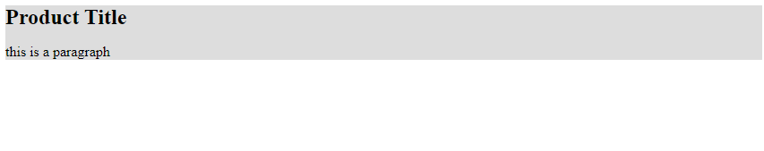
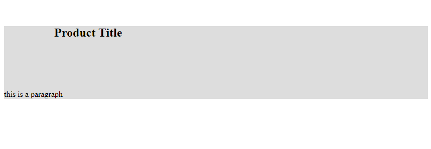
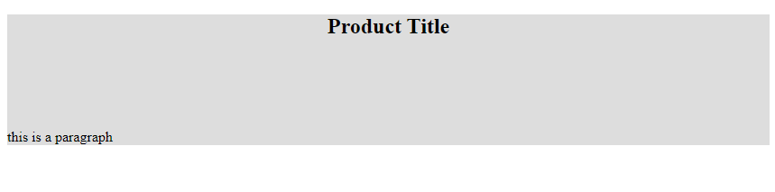

<!-- @format -->

# Margin:

`margin` represents the space between the content & the border.

margin can be set via the `margin` property.

```css
 {
	margin: value; /*adds margin all around*/
	margin: top right bottom left;
	margin: y-value x-value; /*add margin on both axis*/
	margin-top: value; /*add margin to the top*/
	margin-bottom: value; /*add margin to the bottom*/
	margin-right: value; /*add margin to the right*/
	margin-left: value; /*add margin to the left*/
}
```

---

```html
<div class="">
	<h2>Product Title</h2>
	<p>this is a paragraph</p>
</div>
```

```css
div {
	background: #ddd;
}

h2 {
	margin: 0;
}
```



---

```css
div {
	background: #ddd;
}

h2 {
	margin: 100px;
}
```



---

```css
div {
	background: #ddd;
}

h2 {
	width: fit-content;
	margin: 100px auto;
}
```


