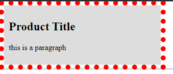

# Outline:

the `outline` is a basic form of borders that doesn't affect the element's width.

the outline is less customizable since you can't set an outline for every side.

you can use `outline-width`, `outline-color` & `outline-style`.

```css
outline-color: color;
outline-width: value;
outline-style: dashed | dotted | solid | etc..

outline: width color style;
``` 

---

```html
<div class="div1">
    <h2>Product Title</h2>
    <p>this is a paragraph</p>
  </div>
```

```css
/** @format */

div {
	background: #ddd;
	width: 300px;
	padding: 10px;
	outline: 10px red dotted;
}

```


