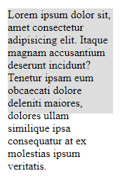
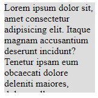
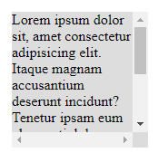
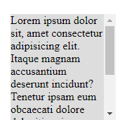

<!-- @format -->

# Overflow

the `overflow` property allows you to handle the element's behavior when the content is larger than the element's dimensions could handle.

by default set to `visible` meaning any overflowing content will show outside the element with no problem

---

```css
overflow: visible | auto | scroll | hidden;
overflow: x y;

overflow-x: visible | auto | scroll | hidden;
overflow-y: visible | auto | scroll | hidden;

```


---

```html
<div>
	Lorem ipsum dolor sit, amet consectetur adipisicing elit. Itaque magnam
	accusantium deserunt incidunt? Tenetur ipsam eum obcaecati dolore deleniti
	maiores, dolores ullam similique ipsa consequatur at ex molestias ipsum
	veritatis.
</div>
```

**overflow visible:**



---

**overflow hidden:**



---

**overflow scroll:**



---

**overflow auto**

