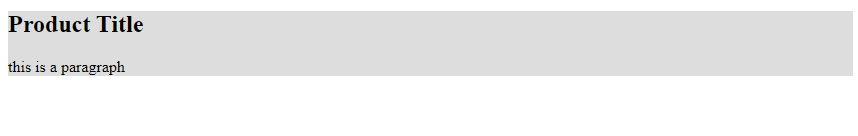
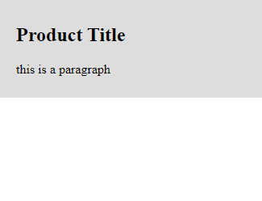

<!-- @format -->

# Padding:

`padding` represents the space between the content & the border.

padding can be set via the `padding` property.

```css
padding: value; /*adds padding all around*/
padding: top right bottom left;
padding: y-value x-value; /*add padding on both axis*/
padding-top: value; /*add padding to the top*/
padding-bottom: value; /*add padding to the bottom*/
padding-right: value; /*add padding to the right*/
padding-left: value; /*add padding to the left*/
```

---

```html
<div class="">
	<h2>Product Title</h2>
	<p>this is a paragraph</p>
</div>
```

```css
div {
	background: #ddd;
	padding: 0;
}
```



---

```css
div {
	background: #ddd;
	padding: 10px 20px;
}
```

