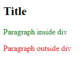

<!-- @format -->

# Selectors

navigation:

- [element selector](#element-selector)
- [class selector](#class-selector)
- [id selector](#id-selector)

---

## Element selector:

the element selector allows you to target all elements of a specific type.

```css
tag-name {
	/*your css here*/
}
```

for example:

```html
<p>This is a normal paragraph</p>
<p>This is a normal paragraph</p>
<p>This is a normal paragraph</p>
```

```css
/** Element Selector -> tag */
p {
	color: red;
}
```


---

## class selector:

using the class selector you can target multiple elements that have the `class` attribute equals the class being targeted.

```css
.class-name {
	/* your css here */
}
```

for example:

```html
<p>This is a normal paragraph</p>
<p>This is a normal paragraph</p>
<p>This is a normal paragraph</p>
<p class="specialP">This is a paragraph with class</p>
```

```css
/** Element Selector -> tag */
p {
	color: red;
}
/** Class selector -> .Class-name  */
.specialP {
	color: blue;
}
```


---

## id selector:

the id selector allows you to target an element with a specific value to the `id` attribute.

```css
#id-name {
	/*your css here*/
}
```

for example:

```html
<p>This is a normal paragraph</p>
<p>This is a normal paragraph</p>
<p>This is a normal paragraph</p>
<p class="specialP">This is a paragraph with class</p>
<p id="specialP">This is a paragraph with id</p>
```

```css
/** Element Selector -> tag */
p {
	color: red;
}
/** Class selector -> .Class-name  */
.specialP {
	color: blue;
}

/** Id selector -> #Id-name*/
#specialP {
	color: green;
}
```


---

## descendent selector:

the `descendent selector` allows you to target specific element based on it's parent.

```css
selector1 selector2 {
	/*css here*/
}
```

the `selector2` is the one we are targeting, we are targeting `selector2` that is a child of `selector1`.

```html
<div>
	<h2>Title</h2>
	<p>Paragraph inside div</p>
</div>
<p>Paragraph outside div</p>
```

```css
div p {
	color: red;
}
```

