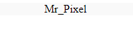
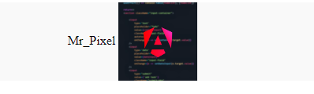
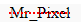
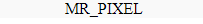
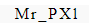
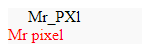
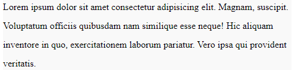
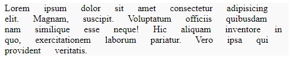
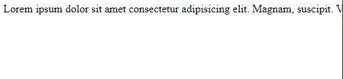

<!-- @format -->

# Text

navigation:

- [color](#color)
- [text shadow](#text-shadow)
- [text align](#text-align)
- [direction](#direction)
- [vertical align](#vertical-align)
- [Text transform](#text-transform)
- [letter spacing](#letter-spacing)
- [text indent](#text-indent)
- [text decoration](#text-decoration)
- [text transform](#text-transform)
- [letter spacing](#letter-spacing)
- [text indent](#text-indent)
- [Line height](#line-height)
- [word spacing](#word-spacing)
- [whitespace](#whitespace)

---

the used html for the following examples.

```html
<div>Mr_Pixel</div>
```

---

## color

using the `color` rule you can change the text color.

```css
div {
	background: #f9f9f9;
	color: gold; /*the color of the text*/
	text-shadow: 2px 2px 4px black; /*shadow, horizontal_shadow(+ -> right) vertical_shadow(+ -> down) blur color */
}
```

---

## text-shadow

the `text-shadow` allows you to create a shadow for the text.

it accept a horizontal_shadow(+values -> right), vertical_shadow(+values -> down), blur & a color.

```css
div {
	background: #f9f9f9;
	color: gold; /*the color of the text*/
	text-shadow: 2px 2px 4px black; /*shadow, horizontal_shadow(+ -> right) vertical_shadow(+ -> down) blur color */
}
```


---

## text-align:

the `text-align` allows you to align the text horizontally.

no matter the direction of the text. it will take the hall text and position it at the give position.

```css
div {
	background: #f9f9f9;
	text-align: center;
}
```



this will center the text in it's container, it can also use `left`, `right`.

---

## direction:

the `direction` allows you to set the writing direction of the text `ltr`(left to right) or `rtl`(right to left).

---

## vertical-align:

the `vertical-align` allows you to set the vertical position for the text surrounding an element.

```html
<div>
	Mr_Pixel
	
</div>
```

```css
div {
	background: #f9f9f9;
	text-align: center;
}

img {
	vertical-align: middle;
}
```



can also accept `bottom` or `top`.

---

## text-decoration:

the `text-decoration` allows you to set the line style of the text.

by adding and removing `underline`, `line-through` or `overline` you can change the line style.

it takes `type` ,`color`, `line style` & `line width`.

```css
div {
	background: #f9f9f9;
	text-align: center;
	text-decoration: line-through red dotted 2px;
}
```



---

## text-transform:

using the `text-transform` you can transform the text like: `uppercase`, `lowercase`, `capitalize`.

```css
div {
	background: #f9f9f9;
	text-align: center;
	text-transform: uppercase;
}
```



`uppercase`: the text (all of it) will be transformed to uppercase.

`lowercase`: the text will be transformed to lowercase.

`capitalize`: the first letter of the text will be transformed to uppercase.

---

## letter spacing

using the `letter-spacing` you can set the space between the letters of the text.

it can also use negative values to tighten the space between the letters.

```css
div {
	background: #f9f9f9;
	text-align: center;
	letter-spacing: 2px;
}
```



---

## text-indent

the `text-indent` allows you to set the indentation of the text.

to make it visible will add a `span`

```html
<div>
	Mr_PXl
	<br />
	<span className="">Mr pixel</span>
</div>
```

```css

div {
	background: #f9f9f9;
  text-align: left;
  text-indent: 20px;
}

span{
  color:red;
}
```



---

## line-height

the `line-height` allows you to set the line height of the text.

it takes a decimal value. representing the multiplier of the font-size or the ration of the line height to the font-size.

in this example

```css
div {
	background: #f9f9f9;
  text-align: left;
  line-height: 2;
}
```



---

## word-spacing

the `word-spacing` allows you to set the space between the words of the text.

```css
div {
	background: #f9f9f9;
  text-align: left;
  word-spacing: 20px;
}
```



---

## white-space

the `white` allows you to set the white space of the text.

which is `normal`, `wrap`, or `nowrap`.

```css
div {
	background: #f9f9f9;
  text-align: left;
  white-space: nowrap;
}
```



`wrap`: the white space will be wrap and if the text exceeds the container it will wrap to the next line.

`nowrap`: the white space will not wrap instead the text will exceed the container.

---
