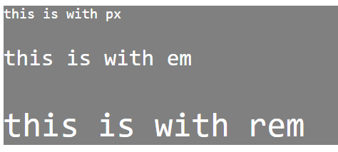

<!-- @format -->

# Typography

navigation:

- [font family](#font-family)
- [font size](#font-size)
- [font weight](#font-weight)
- [font-style](#font-style)

## font-family:

the `font-family` allows you to set the font family for the text. it takes an array of font family names. the `first` is the main font and the rest are `fallbacks`.

```css
div {
	background-color: gray;
	color: white;
	font-family: monospace, sans-serif, "Times New Roman";
}
```


> [!NOTE] that the `Times New Roman` is put between `""` because of the space within it.

---

## font-size:

the `font-size` allows you to set the size of the text. it takes a value or a unit.

```html
<div>
	<p class="px">this is with px</p>
	<p class="time">this is with em</p>
	<p class="root-time">this is with rem</p>
</div>
```

```css
/*
  px: the default unit
  em: multiplies the font size by that of the parent
  rem: multiplies the font size of the html tag
  %: a percentage of the parent's font size
  vw: fraction of the with of the screen (1vw = 1% of the entire screen)
*/
.px {
	font-size: 20px;
}

.time {
	font-size: 2em;
}

.root-time {
	font-size: 3rem;
}
```



---

## font-weight:

the `font-weight` allows you to set the weight of the text. it takes a values like (100, 200, ... -> 900).

or like (bold, bolder, lighter, normal).

```html
<div>
	<p class="weight">font weight</p>
</div>
```

```css
.weight {
	font-weight: 900; /*set the boldness of the font (100 -> 900)(thinnest -> thickest)*/
	/* can use bold, bolder, lighter, normal */
}
```


---

## font-style

the `font-style` allows you to turn the text `italic`, thats it.
