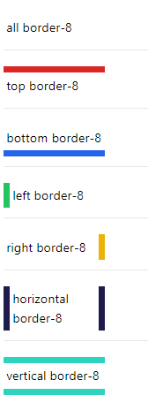
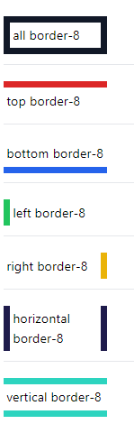
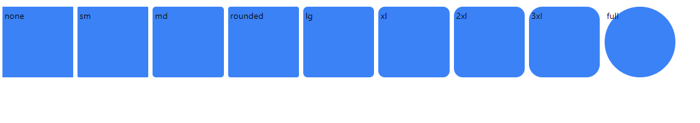

<!-- @format -->

# Borders:

navigation:

- [border](#creating-borders)
- [border color](#coloring-borders)
- [border radius](#)

---

## Creating borders:

using the `border-{0,2, 4, 8, [value]}` you can create a border around the hall element or use `border-{t, b, r, l, x, y}-{value} to add on specific side or axis.

```html
<hr />
<div class="border- border-gray-900 w-32">all border-8</div>

<hr />
<div class="border-t-8 border-red-600 w-32">top border-8</div>

<hr />
<div class="border-b-8 border-blue-600 w-32">bottom border-8</div>

<hr />
<div class="border-l-8 border-green-500 w-32">left border-8</div>

<hr />
<div class="border-r-8 border-yellow-500 w-32">right border-8</div>

<hr />
<div class="border-x-8 border-indigo-950 w-32">horizontal border-8</div>

<hr />
<div class="border-y-8 border-teal-400 w-32">vertical border-8</div>
```



---

## Coloring borders:

using `border-{color}` you can set the border color for the hall border or use `border-{l, r, t, b}-{color}` to add to specific side or the axis using `border-{x, y}-{color}`

```html
<hr />
<div class="border-8 border-gray-900 w-32">all border-8</div>

<hr />
<div class="border-t-8 border-t-red-600 w-32">top border-8</div>

<hr />
<div class="border-b-8 border-b-blue-600 w-32">bottom border-8</div>

<hr />
<div class="border-l-8 border-l-green-500 w-32">left border-8</div>

<hr />
<div class="border-r-8 border-r-yellow-500 w-32">right border-8</div>

<hr />
<div class="border-x-8 border-x-indigo-950 w-32">horizontal border-8</div>

<hr />
<div class="border-y-8 border-y-teal-400 w-32">vertical border-8</div>
```



---

## Border radius:

to set the border radius of an element use the `rounded-{value}` class, this can also use side like`t, b, l,r}` or `{tl, tr, bl, br}`.

```html
<div class="w-32 h-32 bg-blue-500 rounded-none">none</div>
<div class="w-32 h-32 bg-blue-500 rounded-sm">sm</div>
<div class="w-32 h-32 bg-blue-500 rounded-md">md</div>
<div class="w-32 h-32 bg-blue-500 rounded">rounded</div>
<div class="w-32 h-32 bg-blue-500 rounded-lg">lg</div>
<div class="w-32 h-32 bg-blue-500 rounded-xl">xl</div>
<div class="w-32 h-32 bg-blue-500 rounded-2xl">2xl</div>
<div class="w-32 h-32 bg-blue-500 rounded-3xl">3xl</div>
<div class="w-32 h-32 bg-blue-500 rounded-full">full</div>
```

