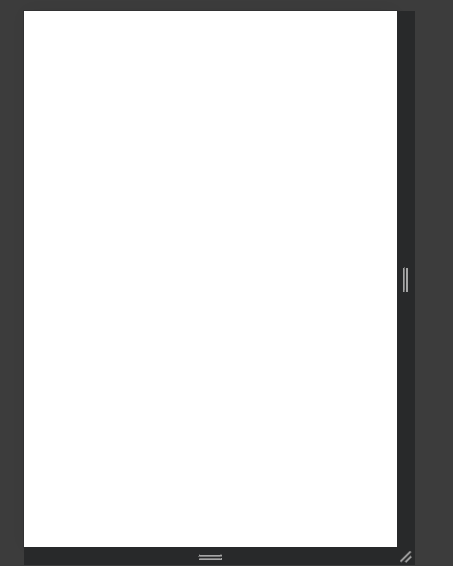
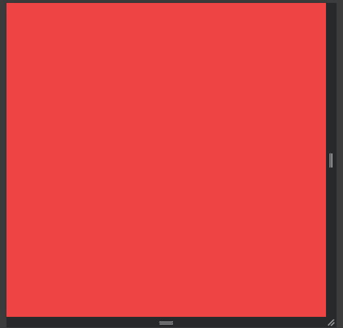
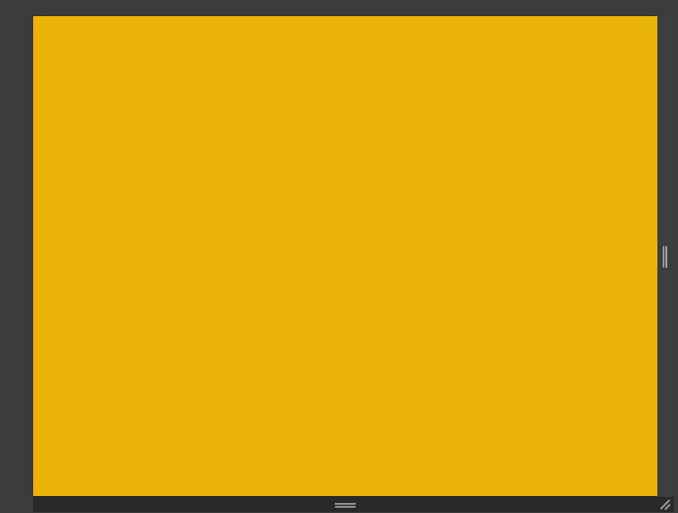
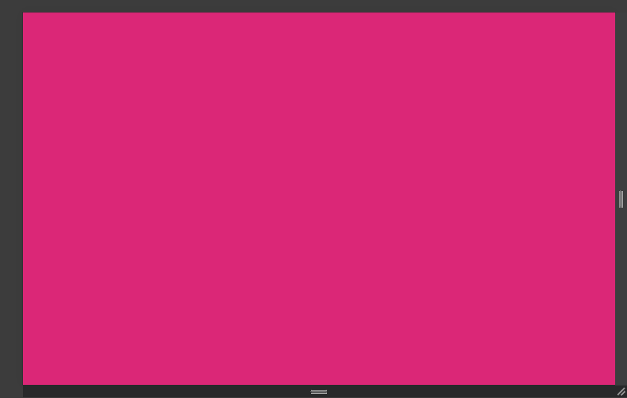
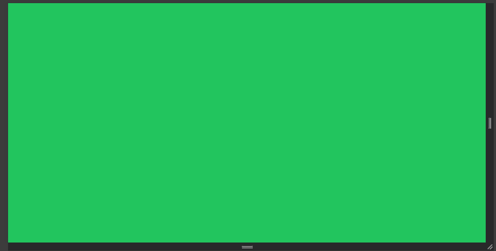
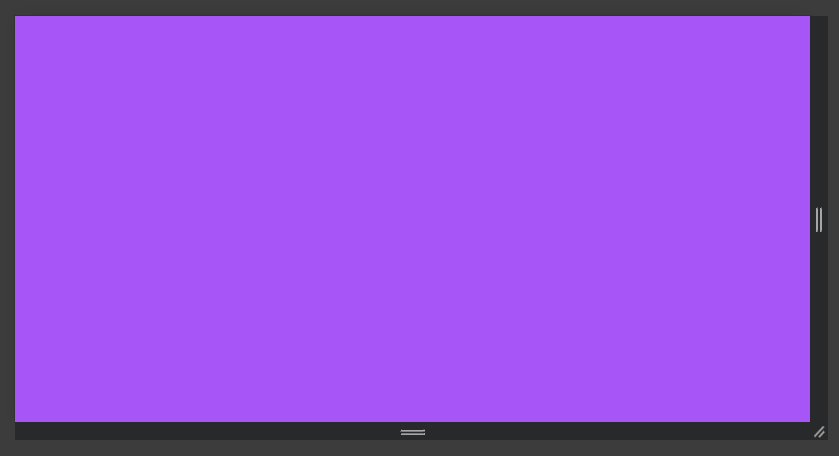

<!-- @format -->

# Break points:

tailwind provides classes for different screen sizes to allow you to make your design responsive. the syntax is like: `{size}:{utility-class}`

```html
<body
	class=" bg-white sm:bg-red-500 md:bg-yellow-500 lg:bg-pink-600 xl:bg-green-500 2xl:bg-purple-500">
	<!-- 
		sm: min width:640px
		md: min width:768px
		lg: min width:1024px
		xl: min width:1280px
		2xl: min width:1536px
		these are the breakpoints in tailwind.
		-->
</body>
```

`sm > screen`:



`sm`:



`md`:



`lg`:



`xl`:



`2xl`:


