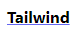

<!-- @format -->

# Colors:

navigation:

- [text color](#text-color)
- [background color](#background-color)
- [text decorations](#text-decoration-color)
- [accent color](#accent-color)
- [arbitrary colors](#arbitrary-colors)

---

## Text color:

in tailwind you can change and modify the text color by using the text utility class with the color & shade like

`text-{color}-{shade}` for example:

```html
<h1 class="text-red-500">Tailwind</h1>
```


all shades are between `50` -> `900`

---

## Background color:

the background color is done similar to the `text color` but replacing `text` with `bg`

```html
<p class="bg-indigo-500">Tailwind</p>
```


---

## Text decoration color:

tailwind doesn't provide classed to add decoration to text like `line-through`, `overline` or `underline` but it also allows you to change the lines color by using `decoration-` then the color with the shade.

```html
<p class="decoration-indigo-500 underline">Tailwind</p>
```



---

## Accent color:

tailwind allows you to change default style to element like `checkboxes` for example, by using the `accent-` then color + shade you can change the colors of the `checkbox` when checked

```html
<input
	type="checkbox"
	checked
	class="accent-red-500" />
<p>accent-red-500</p>
```


---

## Arbitrary colors:

in tailwind you can use a specific custom color of your desire using the Arbitrary syntax, the arbitrary syntax is used like `class-[custom value]` requiring the use of `[]`

for example using an arbitrary color for the text:

```html
<span class="text-[#ff0a1d]">Tailwind</span>
```


