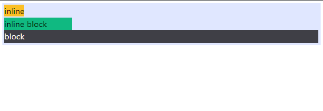

<!-- @format -->

# Display:

you can set the display property of an element using `inline, inline-block, block, hidden` classes.

```html
<div class="bg-indigo-100 p-10 mb-10 w-[600px]">
	<span class="inline bg-amber-400">inline</span>
	<br />
	<span class="inline-block w-32 bg-emerald-500">inline block</span>

	<span class="block text-white bg-zinc-700">block</span>
	<div class="hidden">hidden</div>
</div>
```

