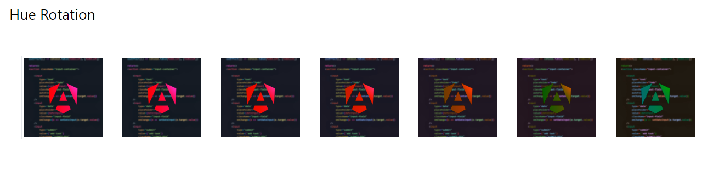
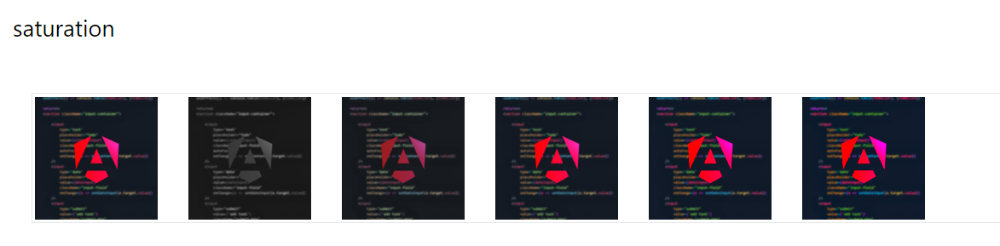

<!-- @format -->

# Filters:

navigation:

- [Contrast](#contrast)
- [Brightness](#brightness)
- [Grayscale](#gray-scale)
- [Hue Rotation](#hue-rotation)
- [Saturation](#saturation)
- [Blur](#blur)
- [Other filters](#other-filters)

---

## Contrast:

using the `contrast-{value}` class you set the contrast of an image, the `contrast` can also accept arbitrary values.

```html
<h1 class="mx-3 text-3xl">Contrast</h1>
<br />
<div class="flex gap-10 p-10 m-10 border">
	
	
	
	
	
	
	
</div>
```


---

## Brightness:

using the `brightness-{value}` class you can adjust the brightness level of an image

```html
<h1 class="mx-3 text-3xl">brightness</h1>
<br />
<div class="flex flex-wrap gap-10 p-10 m-10 border">
	
	
	
	
	
	
	
	
	
	
	
</div>
```


---

## Gray scale:

using the `grayscale-{value}` class you can adjust if the image should be rendered on the grayscale or the full colors scale

```html
<h1 class="mx-3 text-3xl">grayscale</h1>
<br />
<div class="flex flex-wrap gap-10 p-10 m-10 border">
	
	
</div>
```


---

## Hue rotation:

using the `hue-rotate-{value}` you can adjust the hue rotation of an image

```html
<h1 class="mx-3 text-3xl">Hue Rotation</h1>
<br />
<div class="flex flex-wrap gap-10 p-10 m-10 border">
	
	

	
	
	
	
	
</div>
```



---

## Saturation:

the saturation of an image can be adjusted via the `saturate-{value}` class

```html
<h1 class="mx-3 text-3xl">saturation</h1>
<br />
<div class="flex flex-wrap gap-10 p-10 m-10 border">
	
	

	
	
	
	
</div>
```



---

## Blur:

you can add blur to an image using the `blur-{size}` property, this may take an arbitrary value as well

```html
<h1 class="mx-3 text-3xl">Blur</h1>
<br />
<div class="flex flex-wrap gap-10 p-10 m-10 border">
	
	

	
	
	
	
	
	
	
	
	
</div>
```


---

## Other filters:

there are some other filters that can be used as well, all of these have a `{filter}-0` to remove the effect

```html
<h1 class="mx-3 text-3xl">Other filters</h1>
<br />
<div class="flex flex-wrap gap-10 p-10 m-10 border">
	
	

	
</div>
```

