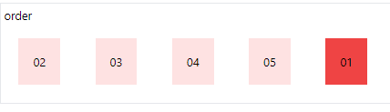

<!-- @format -->

# Flex:

navigation:

- [flex direction](#flex-direction)
- [justification](#justification)
- [alignment](#alignment)
- [grow & shrink](#grow--shrink)
- [order](#order)

---

## Flex direction:

to set a container as a flex-container use the `flex` class followed by `flex-{direction}` the default is `flex-row` but there is also `flex-column`, also there is the possibility of reversing by adding `-reveres` to the end of the direction.

```html
<div class="border">
	flex-row
	<!-- default flex-row -->
	<ul class="flex">
		<!-- ! same as flex flex-row -->
		<li class="p-5 m-5 bg-teal-100">01</li>
		<li class="p-5 m-5 bg-teal-100">02</li>
		<li class="p-5 m-5 bg-teal-100">03</li>
		<li class="p-5 m-5 bg-teal-100">04</li>
		<li class="p-5 m-5 bg-teal-100">05</li>
	</ul>
</div>
<div class="border">
	<!-- default flex-row -->
	flex-col
	<ul class="flex flex-col">
		<!-- also flex-col-reverse & flex-row-reverse -->
		<li class="p-5 m-5 bg-amber-100">01</li>
		<li class="p-5 m-5 bg-amber-100">02</li>
		<li class="p-5 m-5 bg-amber-100">03</li>
		<li class="p-5 m-5 bg-amber-100">04</li>
		<li class="p-5 m-5 bg-amber-100">05</li>
	</ul>
</div>
```


---

## Justification:

using the `justify-{position}` class you can control the flex children positioning on the main axis of the flex container.

```html
<div class="border">
	justify-end
	<!-- default flex-row -->
	<ul class="flex justify-end">
		<!-- ! default justify-start -->
		<li class="p-5 m-5 bg-emerald-100">01</li>
		<li class="p-5 m-5 bg-emerald-100">02</li>
		<li class="p-5 m-5 bg-emerald-100">03</li>
		<li class="p-5 m-5 bg-emerald-100">04</li>
		<li class="p-5 m-5 bg-emerald-100">05</li>
	</ul>
</div>
<div class="border">
	justify-center
	<ul class="flex justify-center">
		<li class="p-5 m-5 bg-teal-100">01</li>
		<li class="p-5 m-5 bg-teal-100">02</li>
		<li class="p-5 m-5 bg-teal-100">03</li>
		<li class="p-5 m-5 bg-teal-100">04</li>
		<li class="p-5 m-5 bg-teal-100">05</li>
	</ul>
</div>
<div class="border">
	justify-between
	<ul class="flex justify-between">
		<li class="p-5 m-5 bg-indigo-100">01</li>
		<li class="p-5 m-5 bg-indigo-100">02</li>
		<li class="p-5 m-5 bg-indigo-100">03</li>
		<li class="p-5 m-5 bg-indigo-100">04</li>
		<li class="p-5 m-5 bg-indigo-100">05</li>
	</ul>
</div>
<div class="border">
	justify-around
	<ul class="flex justify-around">
		<li class="p-5 m-5 bg-green-100">01</li>
		<li class="p-5 m-5 bg-green-100">02</li>
		<li class="p-5 m-5 bg-green-100">03</li>
		<li class="p-5 m-5 bg-green-100">04</li>
		<li class="p-5 m-5 bg-green-100">05</li>
	</ul>
</div>
<div class="border">
	justify-evenly
	<ul class="flex justify-evenly">
		<li class="p-5 m-5 bg-red-100">01</li>
		<li class="p-5 m-5 bg-red-100">02</li>
		<li class="p-5 m-5 bg-red-100">03</li>
		<li class="p-5 m-5 bg-red-100">04</li>
		<li class="p-5 m-5 bg-red-100">05</li>
	</ul>
</div>
```


---

## alignment:

to align you flex-items use the `items-{position}` class.

```html
<div class="border">
	alignment:
	<div class="flex flex-col items-center justify-center">
		<!-- default flex is items-start -->
		<div class="p-5 m-5 bg-amber-100">01</div>
		<div class="p-5 m-5 bg-amber-100">02</div>
	</div>
</div>
<div class="border">
	<div class="flex flex-col items-end justify-center">
		<!-- default flex is items-start -->
		<div class="p-5 m-5 bg-amber-100">01</div>
		<div class="p-5 m-5 bg-amber-100">02</div>
	</div>
</div>
<div class="border">
	<div class="flex flex-col items-stretch">
		<!-- default flex is items-start -->
		<div class="p-5 m-5 bg-amber-100">01</div>
		<div class="p-5 m-5 bg-amber-100">02</div>
	</div>
</div>
<div class="border">
	<div class="flex flex-col items-baseline justify-center">
		<!-- default flex is items-start -->
		<div class="p-5 m-5 bg-amber-100">01</div>
		<div class="p-5 m-5 bg-amber-100">02</div>
	</div>
</div>
```


---

## Grow & shrink:

you can control the flex child's growing & shrinking priority .

```html
<div class="border">
	<ul class="flex">
		<li class="flex-1 p-5 m-5 bg-red-100">01</li>
		<!--flex-1: the element will grow  & shrink as necessary-->
		<li class="flex-auto p-5 m-5 bg-blue-500">02</li>
		<!--flex-auto: the element will grow and shrink automatically-->
		<li class="flex-none p-5 m-5 bg-red-500">03</li>
		<!--flex-none: the element will neither shrink nor grow-->
		<li class="flex-grow-0 flex-shrink p-5 m-5 bg-red-100">04</li>
		<!--flex-grow-0: the element will not grow. It will shrink.-->
	</ul>
</div>
```


---

## Order:

you can change the order of the flex child without moving it using the `order-{order}` class this will render the element as if it were at the that `order`.

```html
<div class="border">
	order
	<ul class="flex gap-2">
		<li class="order-5 p-5 m-5 bg-red-500">01</li>
		<li class="p-5 m-5 bg-red-100">02</li>
		<li class="p-5 m-5 bg-red-100">03</li>
		<li class="p-5 m-5 bg-red-100">04</li>
		<li class="p-5 m-5 bg-red-100">05</li>
	</ul>
</div>
```


