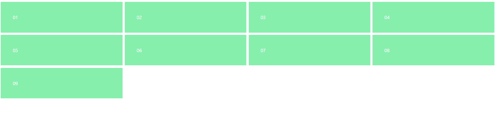
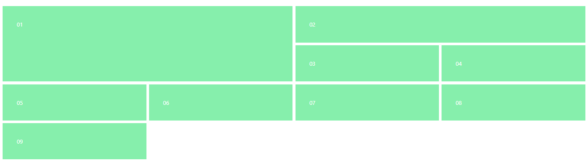

<!-- @format -->

# Grid:

using the `grid` class you can set an element as a grid, then use `grid-cols-{number}` & `grid-rows-{number}` to control the grid size.

```html
<div class="w-100 text-white grid grid-cols-4 grid-rows-4 gap-2">
	<div class="p-10 bg-green-300">01</div>
	<div class="p-10 bg-green-300">02</div>
	<div class="p-10 bg-green-300">03</div>
	<div class="p-10 bg-green-300">04</div>
	<div class="p-10 bg-green-300">05</div>
	<div class="p-10 bg-green-300">06</div>
	<div class="p-10 bg-green-300">07</div>
	<div class="p-10 bg-green-300">08</div>
	<div class="p-10 bg-green-300">09</div>
</div>
```



also you can control how many rows & columns a child can take using `row-span-{number}` & `cols-span-{number}`

```html
<div class="w-100 text-white grid grid-cols-4 gap-2">
	<div class="p-10 bg-green-300 col-span-2 row-span-2">01</div>
	<div class="p-10 bg-green-300 col-span-2">02</div>
	<div class="p-10 bg-green-300">03</div>
	<div class="p-10 bg-green-300">04</div>
	<div class="p-10 bg-green-300">05</div>
	<div class="p-10 bg-green-300">06</div>
	<div class="p-10 bg-green-300">07</div>
	<div class="p-10 bg-green-300">08</div>
	<div class="p-10 bg-green-300">09</div>
</div>
```

