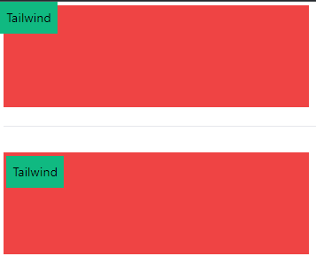

<!-- @format -->

# Positioning:

---

you can easily set the position of any element using `absolute, relative, fixed, sticky, static` classes, then set the position by using `{top, left, right, bottom}-{value}`

```html
<div class="h-32 bg-red-500 w-96">
			<div class="absolute top-0 left-0 h-10 p-2 max-w-fit bg-emerald-500">Tailwind</div>
		</div>
		<br>
		<hr>
		<br>
		<div class="h-32 bg-red-500 w-96">
			<div class="relative top-0 left-0 h-10 p-2 max-w-fit bg-emerald-500">Tailwind</div>
		</div>
</div>

```

