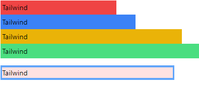
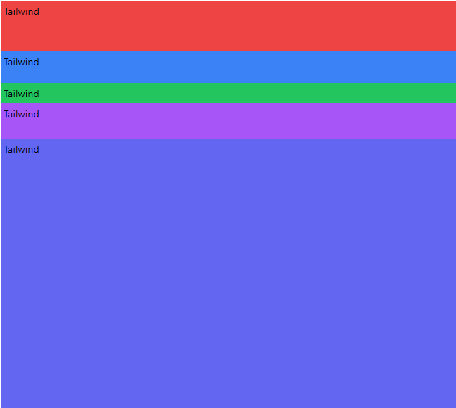

<!-- @format -->

# Sizing:

navigation:

---

## width:

setting the width in tailwind is done using the `w-{value}` class, also can accept arbitrary values.

the `value` can represent a percentage like `w-1/2` -> `width: 50%` or a number like `w-1 -> width: 4px`, or `w-px -> width: 1px` & so on

```html
<div class="w-64 bg-red-500">Tailwind</div>
<div class="w-1/5 bg-blue-500">Tailwind</div>
<div class="w-[400px] bg-yellow-500">Tailwind</div>
<div class="w-screen bg-green-400">Tailwind</div>
<div class="w-96 py-4 my-4 bg-blue-400">
	<div class="w-full bg-red-100">Tailwind</div>
</div>
```

;

---

## Max width:

setting the max-width in tailwind can be done using `max-w-{value}`.

the `value` can represent the different screen sizes like `sm`, `md`,...

```html
<div class="max-w-screen-lg bg-red-300 min-w-96">
	Lorem ipsum dolor sit amet consectetur adipisicing elit. Nihil, officia? Ut
	tempore nostrum itaque deleniti labore temporibus explicabo sapiente
	blanditiis ullam qui? Mollitia neque, ducimus officia suscipit nihil quia
	numquam!
</div>
```

this will render a div that will never grow pass `1024px` which is the `screen-lg`

---

## Min width:

this follows the same rule as max width but replacing `max` with `min`, this can't be set to a specific screen size like `max-w`

---

## height:

the `height`, `max height` & `min height` are identical in usage to the `width`,`min width` & `max width` replacing `w` with `h`, but the `h` can't use the `screen-{size}` like you would with `max-w-screen-sm` for example:

```html
<div class="h-20 bg-red-500">Tailwind</div>
<div class="h-[50px] bg-blue-500">Tailwind</div>
<div class="bg-green-500 h-1/6">Tailwind</div>
<div class="bg-purple-500 max-h-96 min-h-14">Tailwind</div>
<div class="max-h-screen min-h-screen bg-indigo-500">Tailwind</div>
```

