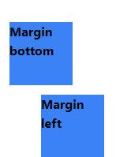

<!-- @format -->

# Spacing:

navigation:

- [margin & padding](#margin--padding)
- [space-x & space-y](#space-x--space-y)

---

## Margin & Padding:

similar to how `margin` & `padding` share the same syntax in css they do just that in tailwind both follow the same syntax but using `m` for margin & `p` for padding.

both can be used in many ways:

#### all around:

using `m-{value}` or `p-{value}` will add all around spacing

```html
<span class="m-5 bg-blue-500">Margin</span>
<span class="p-5 bg-blue-500">padding</span>
```


#### single side:

using `m{t, b, l, r}-{value}` or `p{t, b, l, r}-{value}`

you can set margin for a single side:

```html
<div class="mb-3 w-20 h-20 bg-blue-500">Margin bottom</div>
<div class="ml-10 w-20 h-20 bg-blue-500">Margin left</div>
```



#### on an axis:

using `m{x, y}-{value}` and the same for padding you can set the margin or padding for an axis.

```html
<div class="mx-auto my-4 w-fit h-fit bg-blue-500">Center on x & 4 on y</div>
```


> [!TIP] 
> margin & padding can take arbitrary values

## Space-x & Space-y:

both apply spacing to all children of a flex box parent `space-{x, y}-{value}` by applying margin to every children in that element