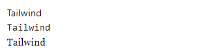
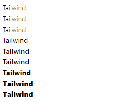
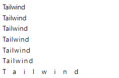
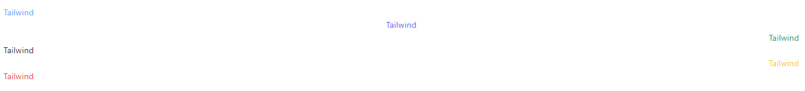
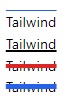
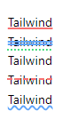
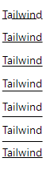
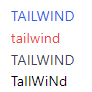

<!-- @format -->

# Typography:

navigation:

- [Font size](#font-size)
- [Font family](#font-family)
- [Font weight](#font-weight)
- [Letter spacing](#letter-spacing)
- [Text alignment](#text-alignment)
- [Text decoration](#text-decoration)
- [Decoration style](#decoration-style)
- [Decoration offset](#decoration-offset)
- [Text transform](#text-transform)

---

## Font size:

to change the font of the text in tailwind you use `text-{value}` to set the size of the text.

the accepted values are:

- xs -> size: 12px, line height: 16px
- sm -> size: 14px, line height: 20px
- base (default) -> size: 16px, line height: 24px
- lg -> size: 18px, line height: 28px
- xl -> size: 20px, line height: 28px
- 2xl-> size: 24px, line height: 32
- 3xl-> size: 30px, line height: 36px
- 4xl-> size: 36px, line height: 40px
- 5xl-> size: 48px, line height: 1
- 6xl-> size: 60px, line height: 1
- 7xl-> size: 72px, line height: 1
- 8xl-> size: 96px, line height: 1
- 9xl-> size: 128px, line height: 1

also it can take arbitrary values.

```html
<p class="text-xs text-red-500">Tailwind</p>
<p class="text-sm text-red-500">Tailwind</p>
<p class="text-base text-red-500">Tailwind</p>
<p class="text-lg text-red-500">Tailwind</p>
<p class="text-xl text-red-500">Tailwind</p>
<p class="text-2xl text-red-500">Tailwind</p>
<p class="text-3xl text-red-500">Tailwind</p>
<p class="text-4xl text-red-500">Tailwind</p>
<p class="text-5xl text-red-500">Tailwind</p>
<p class="text-6xl text-red-500">Tailwind</p>
<p class="text-red-500 text-7xl">Tailwind</p>
<p class="text-red-500 text-8xl">Tailwind</p>
<p class="text-red-500 text-9xl">Tailwind</p>
<p class="text-[20px] text-red-600">Tailwind</p>
```


---

## Font family:

you can easily set the font family in tailwind using `font-{family}` class.

it can accept:

- sans
- mono
- serif

```html
<!-- font-sans -->
<p class="font-sans">Tailwind</p>
<!-- font-mono -->
<p class="font-mono">Tailwind</p>
<!-- font-serif -->
<p class="font-serif">Tailwind</p>
```



---

## Font weight:

using `font-{value}` you can set the weight of the font.

the accepted values are:

- thin -> weight: 100
- extralight -> weight: 200
- light -> weight: 300
- normal -> weight: 400
- medium -> weight: 500
- semibold-> weight: 600
- bold-> weight: 700
- extrabold-> weight: 800
- black-> weight: 900

```html
<p class="font-thin">Tailwind</p>
<p class="font-extralight">Tailwind</p>
<p class="font-light">Tailwind</p>
<p class="font-normal">Tailwind</p>
<p class="font-medium">Tailwind</p>
<p class="font-semibold">Tailwind</p>
<p class="font-bold">Tailwind</p>
<p class="font-extrabold">Tailwind</p>
<p class="font-black">Tailwind</p>
```



---

## Letter spacing:

using tailwind you can easily set the spacing between letters using `tracking-{value}`.

the accepted values are:

- tighter -> letter spacing: -0.05rem
- tight -> letter spacing: -0.025rem
- normal -> letter spacing: 0rem
- wide -> letter spacing: 0.025rem
- wider -> letter spacing: 0.05rem
- widest -> letter spacing: 0.1rem

and can also accept arbitrary values

```html
<p class="tracking-tighter">Tailwind</p>
<p class="tracking-tight">Tailwind</p>
<p class="tracking-normal">Tailwind</p>
<p class="tracking-wide">Tailwind</p>
<p class="tracking-wider">Tailwind</p>
<p class="tracking-widest">Tailwind</p>
<p class="tracking-[1rem]">Tailwind</p>
```



---

## Text alignment:

using `text-{position}` you can align your text.

it accepts:

- left -> align left
- right -> align right
- justify -> align justify
- center -> align center
- start -> align at start
- end -> align at end

```html
<div class="">
	<p class="text-left text-blue-400">Tailwind</p>
	<p class="text-center text-indigo-500">Tailwind</p>
	<p class="text-right text-green-600">Tailwind</p>
	<p class="text-gray-800 text-start">Tailwind</p>
	<p class="text-yellow-400 text-end">Tailwind</p>
	<p class="text-justify text-red-500">Tailwind</p>
</div>
```



---

## Text decoration:

with text decoration you can add lines through, above or below you text & customize the line's thickness.

using:

- `underline`
- `line-though`
- `overline`

to add line & the `decoration-{value}` to set the thickness.

the value of decoration is `1, 2, 4, 8` each value represent the thickness in pixels, 1 -> 1px and so on

```html
<p class="overline decoration-1 decoration-blue-600">Tailwind</p>
<p class="underline decoration-2">Tailwind</p>
<p class="line-through decoration-4 decoration-red-600">Tailwind</p>
<p class="line-through decoration-[6px] decoration-blue-600">Tailwind</p>
```



---

## Decoration style:

using `decoration-{style}` allows you to set the line style.

accepted values:

- solid
- double
- dotted
- dashed
- wavy

```html
<p class="underline decoration-solid decoration-red-400 decoration-2">
	Tailwind
</p>
<p class="line-through decoration-double decoration-blue-400 decoration-2">
	Tailwind
</p>
<p class="overline decoration-dotted decoration-green-400 decoration-2">
	Tailwind
</p>
<p class="line-through decoration-dashed decoration-red-400 decoration-2">
	Tailwind
</p>
<p class="underline decoration-wavy decoration-blue-400 decoration-2">
	Tailwind
</p>
```



---

## Decoration offset:

using `underline-offset-{value}` you can set the offset between the decoration line and the text.

it accepts values from `{0 -> 2},4, 8` & arbitrary values

```html
<p class="my-2 underline underline-offset-0">Tailwind</p>
<p class="my-2 underline underline-offset-1">Tailwind</p>
<p class="my-2 underline underline-offset-2">Tailwind</p>
<p class="my-2 underline underline-offset-4">Tailwind</p>
<p class="my-2 underline underline-offset-8">Tailwind</p>
<p class="my-2 underline underline-offset-[10px]">Tailwind</p>
<p class="my-2 underline underline-offset-auto">Tailwind</p>
```



---

## Text transform:

using `uppercase, capitalize, lowercase, normal-case` you can transform you text like:

```html
<p class="text-blue-600 uppercase">tailwind</p>
<p class="text-red-500 lowercase">TAILWIND</p>
<p class="text-gray-700 capitalize">tAILWIND</p>
<p class="normal-case">TaIlWiNd</p>
```

