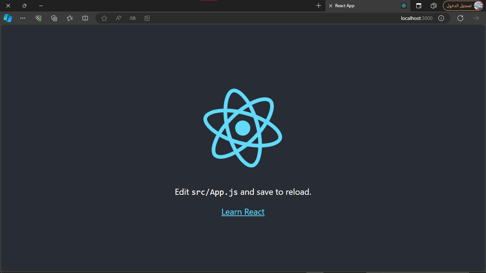
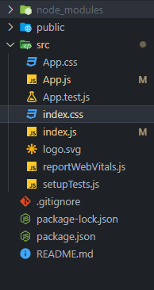
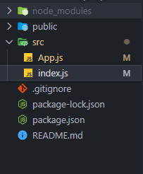

# Creating a Project:

---

to create a react project use:

```powershell
npx create-react-app appname
```
>[!NOTE]
> the react app will auto initialize a git repo

after waiting for the files to be downloaded use:

```powershell
cd appname
```

then use:
```powershell
npm start
```

---

# Files and server

to start the test server, few seconds later and you will see this:


---


 

in vscode you will have these files:

mostly you won't need most of theses so you can delet all files in src except
``App.js``
``index.js``
and make sure to remove any import from the old files that have been removed 

---

after doing that you will have:



---

