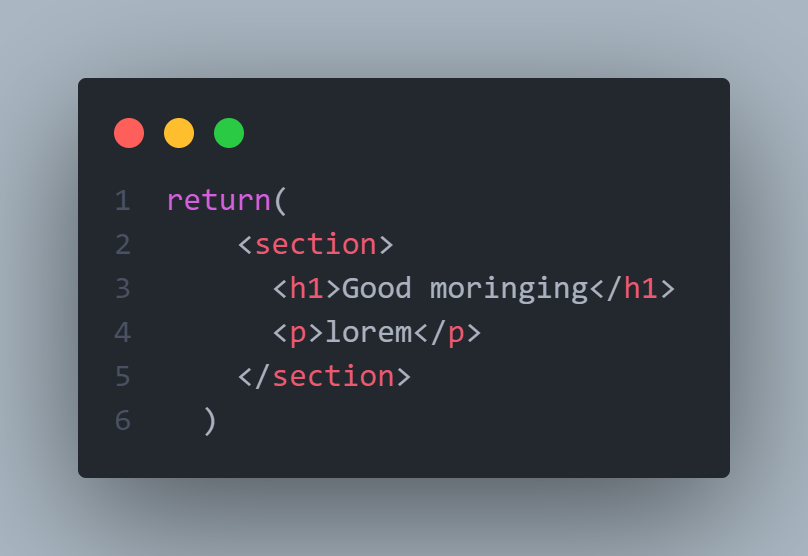
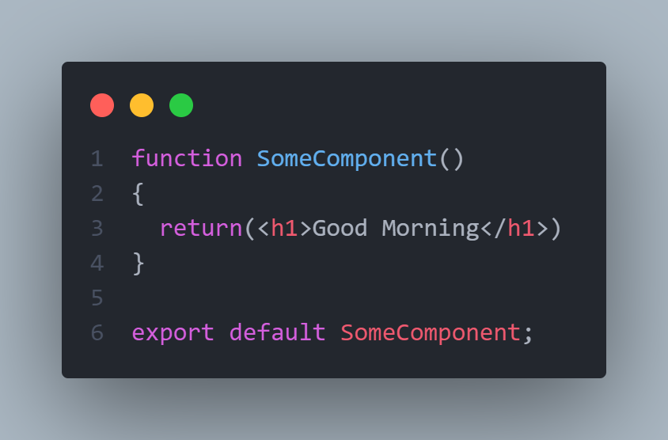
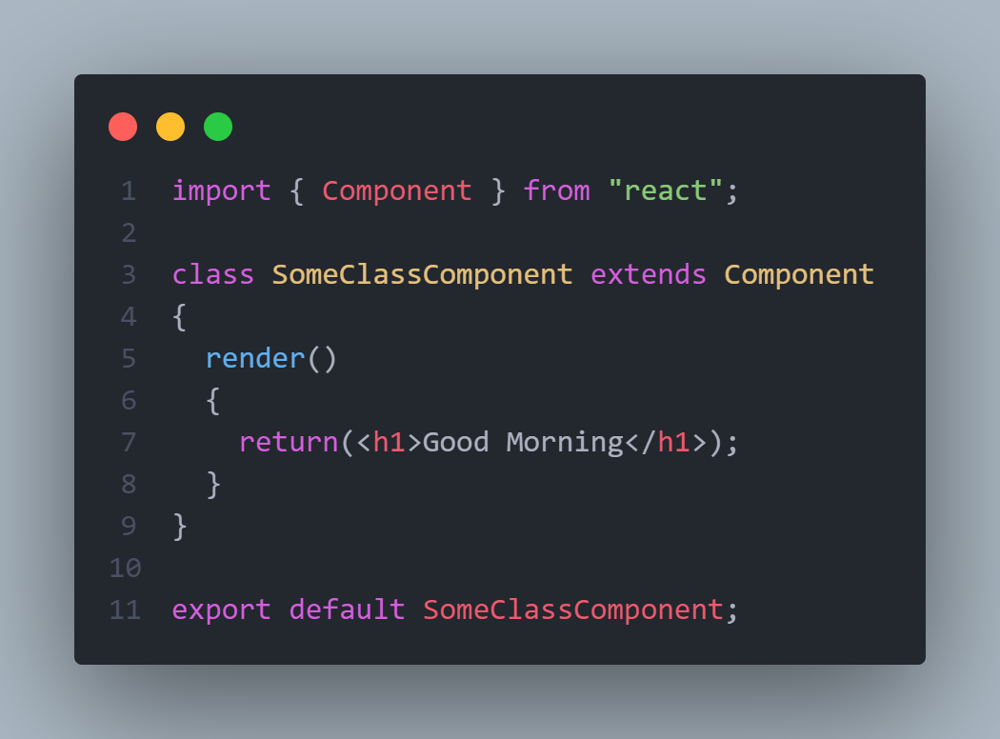
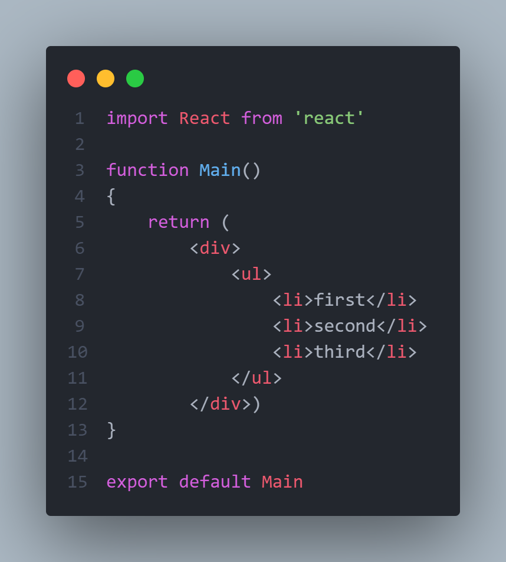
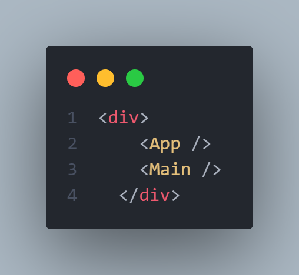
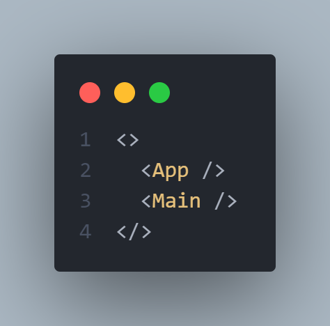

# Components:

---

> [!IMPORTANT]
> any jsx has to have at least one parent

Components are the basis of react, they retrun what is called ``jsx`` wich is basicly html in javascript
``jsx`` elements can take the same attributes as the html files but some are changed:


- class => className
- for => htmlFor

**jsx**:



---

### to create a functional component:

while in the ``App.js`` file for expample creat a new funcion with the first letter in uppercase like:



### to create a class component:

while in the ``App.js`` file for expample creat a new funcion with the first letter in uppercase like:
> [!NOTE]
> You must import the Componenet calss for this to work



---

to call components in other componenets you have to import it

```jsx
<componentName />
```

for example:

i created a component in a file name ``Main.jsx``



and then i imported this component in ``index.js`` and added it in the returns of the ``root.render()`` method return,
not that i had to put a parent so i can compine both components in on render



if you don't want to create the container each time there is a solution name **fragments**

fragments examples:



the <> & </> are fragments that you can think of as an imaginery container that won't be rendered in the html result
