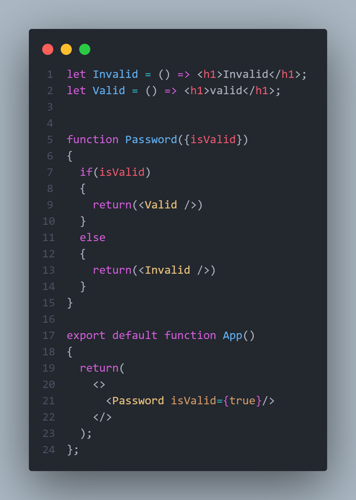

# Conditional Rendering
---

conditional rendering is proccess in which you show specific output to the page based on some conditoin like:

here i am creating two components ``Valid`` and ``Invaid`` to be rendered if a condition is true

then i created a new component ``Password`` that look for the ``isValid`` prop, and if it's true display the ``Valid`` component else dispalye ``Invalid``

and then in the ``App`` we are rendering this ``Password`` with the ``isValid`` set to ``true``