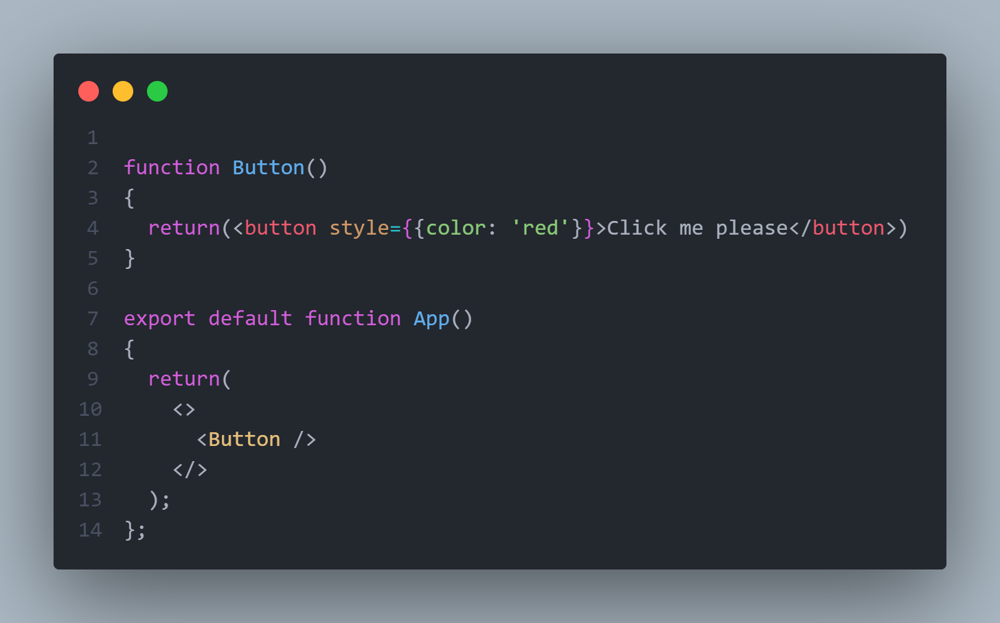
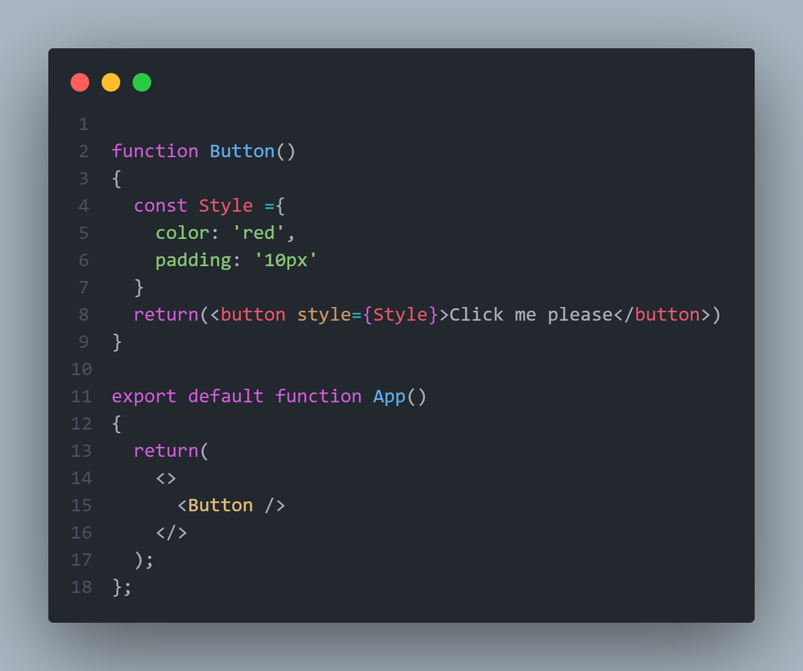
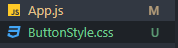
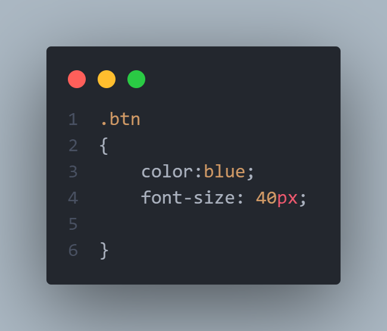
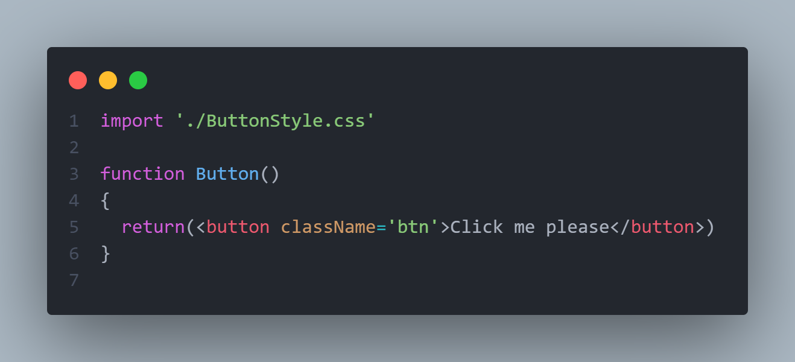

# Styling:

---

styling in react can be done via a css file link or inline or as an object var

### inline:

output:

### var styling:

output:

### imported:

here i created a new file ``ButtonStyle.css``

and in this file i added this:

in the ``App.js`` file i imported this file:

output:

=======
# Styling in react:

---

in react style can be done inline and imported

### inline style:

use ``{{}}`` then your style as keys and values example:

result:

---

### sperated styling:

use an import statment to import the css file and it will work alone
>>>>>>> e2f31b760967a8b14170a5647ee8e1915740b94f
