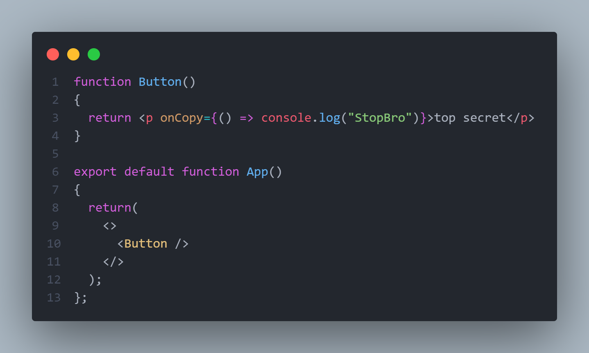

# Evenets:

---

in react events are used inline

```javascript

function Component()
{
    return(<button onclick = () => console.log('Clicked')>Click Me</button>)
}

```

in this example this button will log ``Clicked`` to the console when clikce

> [!NOTE]
> we use an arrow function so that the event function is't triggered onload or once



here we created a `p` element that will log a messege to the conosle when it's content is copied
