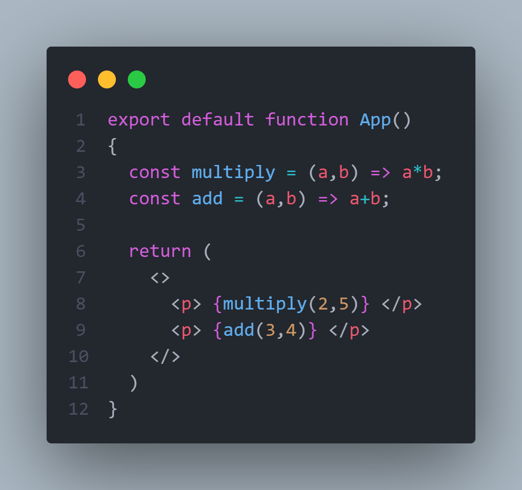

# Expreesions:

to use js expressions in jsx you can use { }:

here i am creating two function ``multiply`` and ``add``

then iam appending the result of both fuctions to the text in the ``
 
`` elements