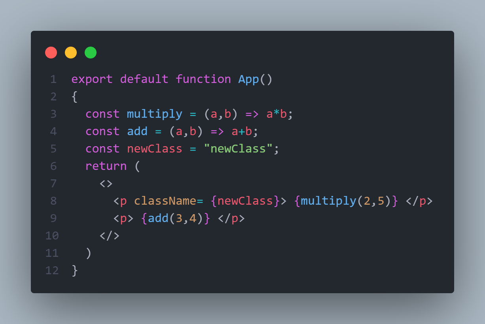

# Expressions:

---

to use js expressions in jsx you can use { }:

```javascript
export default function App()
{
    const multiply = (a,b) => a*b;
    const add = (a,b) => a+b;
    
    return(<>
        <p>2 * 3 = {multiply(2,3)}</p>
        <p>2 + 3 = {add(2,3)}</p>
    </>)
}
```


here i am creating two function ``multiply`` and ``add``

then iam appending the result of both functions to the text in the ``<p> </p>`` elements

or in this case:



```javascript
export default function App()
{
    const pClass = 'content';
    
    return(<>
        <p className={pClass}>{pClass}</p>
    </>)
}
```

here i am appending the value of ``pClass`` to the `className` property of the p element