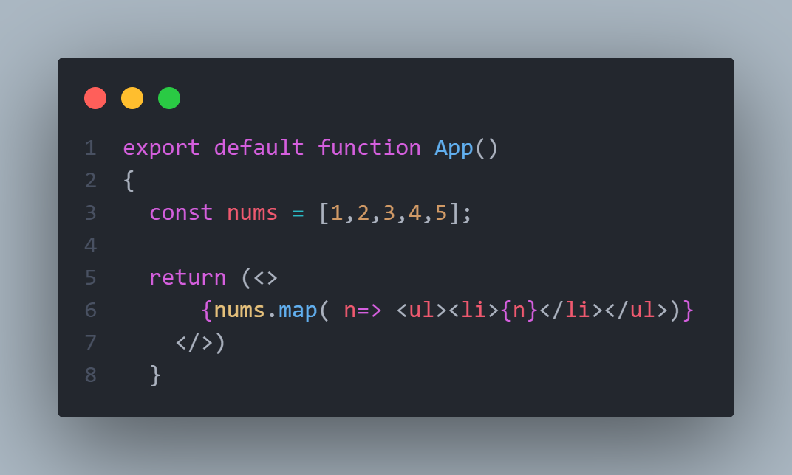
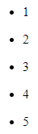
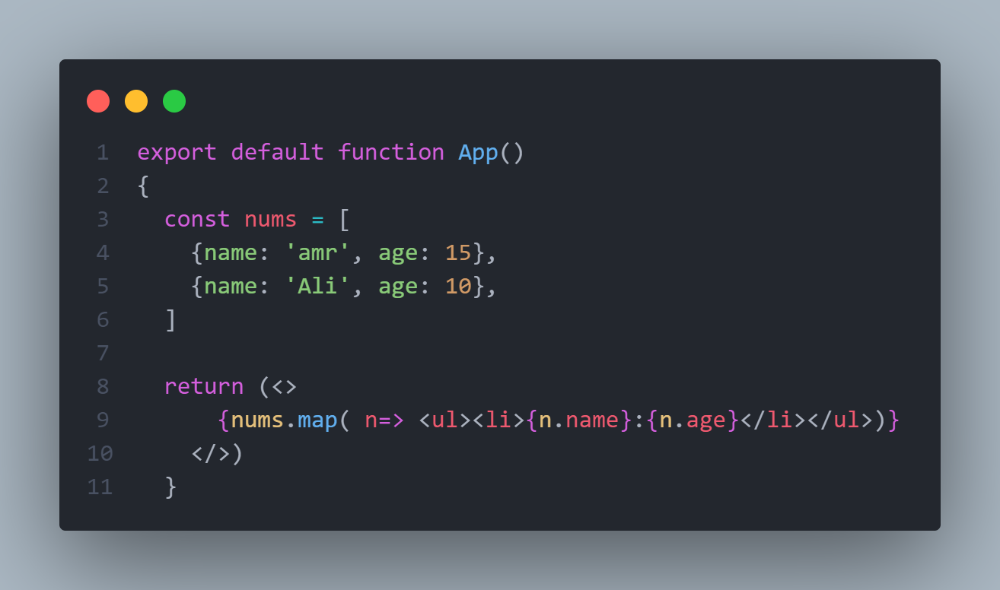

# Lists of data

---

to render the data in an array as an html you can use ``.map(callbackfunction)``

example: 

output:

---

another example:

here i created an array of object that has name and age of some useres and i used the ``.map(callbackfunction)`` to loop over them and get each object, access it's name and age values and render them out as an unorderd list