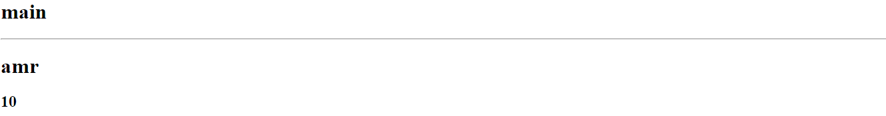

# Props:

---

props are properties that are set as a parameter in the component that can be passed to it later by another component think of them like html attributes

> [!NOTE]
> using the props is condsidered a js expression that has to be used with in ``{ }`` in the jsx


example:


```javascript
export function User(prop)
{
    return(
    <>
        <h1>{props.name}</h1>
        <h3>{props.age}</h3>
    </>)
}
```


here i am creating a new component named ``User`` that takes a prop so i can get the name and age of the user

```html
<User name='amr' age={10}>
```


here i am passing the value of name and age to that ``User`` componenet so it could be rendered properly

output:



---

# Props destructuring:

```javascript
export function User({name, age})
{
    return(
    <>
        <h1>{name}</h1>
        <h3>{age}</h3>
    </>)
}
```

here i am destructuring the props into name and age so i can use them directly instead of ``props.name`` or ``props.age``

---

# Children prosps:


```javascript
export function User({name, age, content})
{
    return(
    <>
        <h1>{name}</h1>
        <h3>{age}</h3>
        {content}
    </>)
}
```

children props are delt with as other props and at the end you render them in therir place in beteween ``{ } ``

```javascript
export function App()
{
    return(
        <div>
            <User name='amr' age= {10}><p>children prop</p></User>
        </div>
    )
}
```

here and i changed the ``User`` component tag form
``<User />`` to ``<User> </User>`` to be able to worl with children props, in this case it's ``<p> just a children prop``

