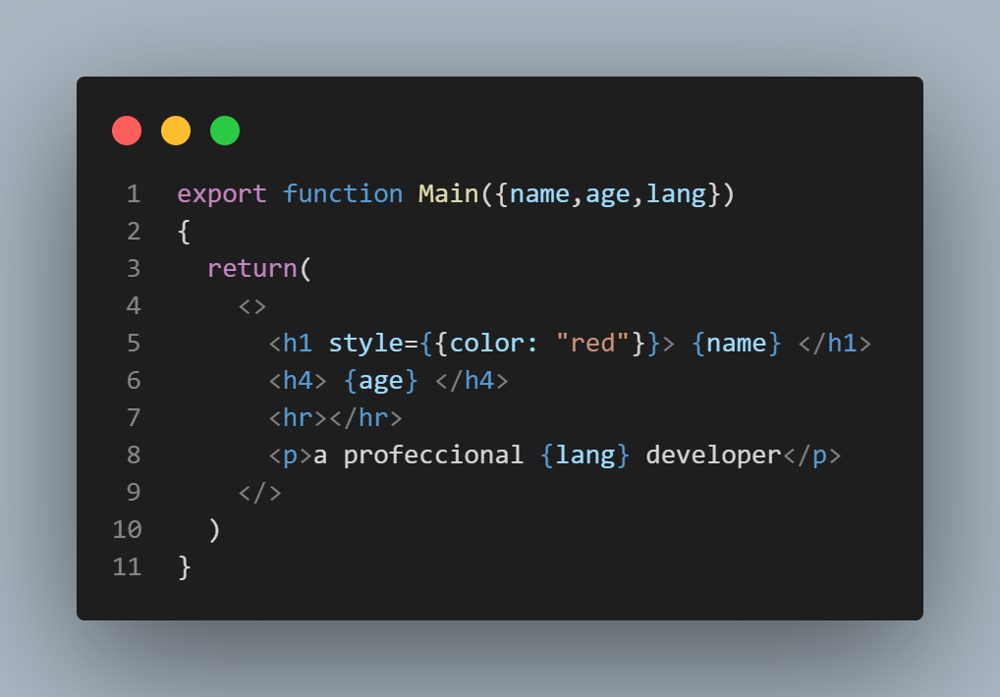

# Styling in react:

---

in react style can be done inline and imported

### inline style:

use ``{{}}`` then your style as keys and values example:

result:

---

### sperated styling:

use an import statment to import the css file and it will work alone