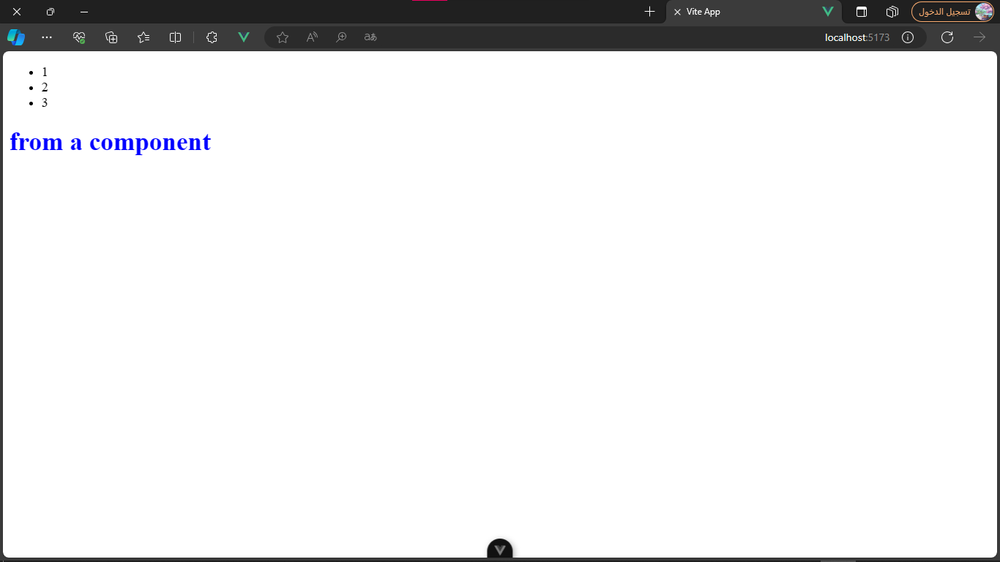

# Components:

components are the main building block of vue.

a basic component consists of 3 parts.

- html => defined in the `template` tag
- css => defined in the `style` tag
- js => defined in the `script` tag

for example i created a new component in the `components` folder named `HelloComponent`:

```vue
<!-- HTML -->
<template>
    <h1>from a component</h1>
</template>

<!-- CSS -->
<style scoped>
h1
{
    color: blue;
}
</style>

<!-- JS -->

<script setup>
console.log('hello')
</script>
```

then in the `App.vue` file i imported the component:
```vue
<script setup>
import HelloComponent from './components/HelloComponents.vue'
</script>

<template>
    <ul id="ul">
        <li class="item">1</li>
        <li class="item">2</li>
        <li class="item">3</li>
    </ul>
    <HelloComponent />
</template>

<style scoped></style>

```

result:

