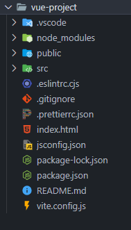

# Set up:

to set up a new vue project use:

```powershell
npm create vue@latest
```

or use vite:

```powershell
npm create vite@latest
```

both will ask for some info like using typescript and other stuff.
after that enter the project by using:

```powershell
cd project-name
```

after that use:

```powershell
npm i
```

this will install all dependencies after downloading you will be able to start the server by using:

```powershell
npm run dev
```

then press `o` + `Enter` to open it in your browser.

---

# File Structure:

after the download you will have these files:



the `src` file is where you will work most of the time.

you can remove all content in the `src/components` folder and empty the `App.vue` file then remove the css import in the `main.js` so you can start from scratch.