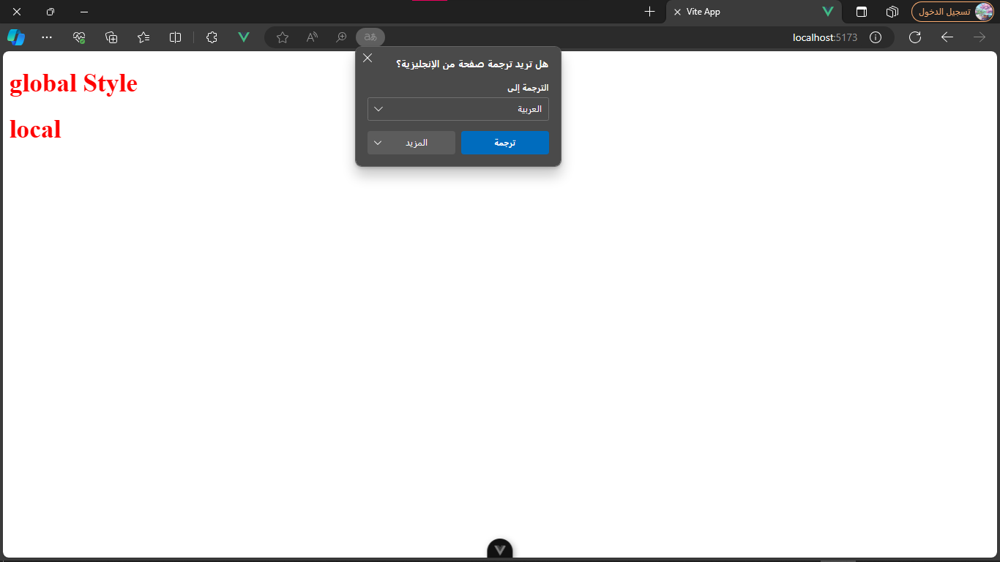
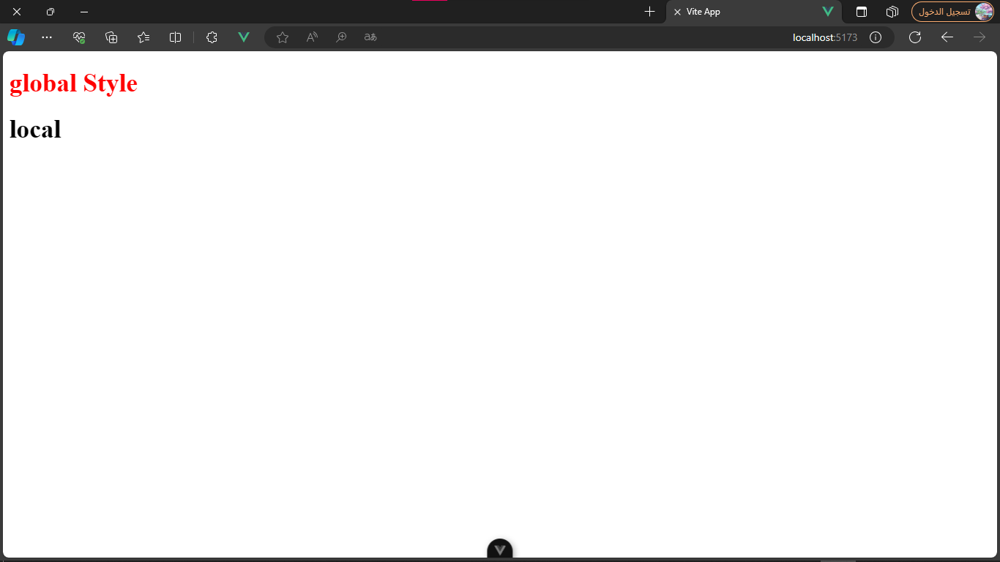
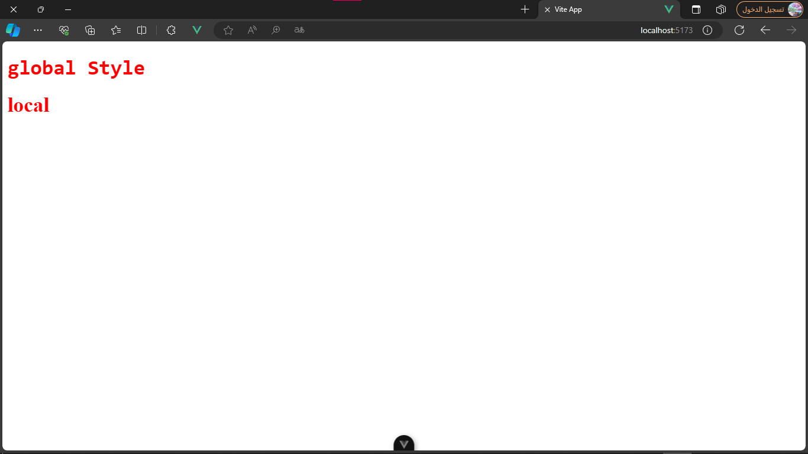

# Styling:

styling in vue has four shapes:

- [Global:](#global)
- [Local:](#local)
- [Combined:](#combined)
- [Module:](#module)

---

# Global:

global styling happens when using `<style></style>` tags with out the `scoped` attribute. this will cause that all components with this class in the same file will have this style

for example i created `Global.vue` and `Local.vue` each having an h1 with class `global`.

in `Global.vue`:

```vue
<template>
  <h1 class="global">global Style</h1>
</template>

<style>
.global {
  color: red;
}
</style>

```

and then in `Local.vue`:

```vue
<template>
  <h1 class="global">local</h1>
</template>
```

then i imported both of them in the `App.vue`:

```vue
<script setup>
import Global from './components/Global.vue'
import Local from './components/Local.vue'
</script>

<template>
  <Global />
  <Local />
</template>

```

result:



---

# Local:

in the local style you just add `scoped` attribute to the style tags so following the previous example `Global.vue` will look like:

```vue
<template>
  <h1 class="global">global Style</h1>
</template>

<style scoped>
.global {
  color: red;
}
</style>

```

and the rest of the files will look the same.

result:



---

# Combined:

the combined uses both styles in one so you use `<style></style>` and `<style scoped></style>`

following the [global:](#global) style example, `Global.vue` will look like:

```vue
<template>
  <h1 class="global">global Style</h1>
</template>

<style>
.global {
  color: red;
}
</style>

<style scoped>
.global {
  font-family: monospace, Cochin, Georgia, Times, 'Times New Roman', serif;
}
</style>

```

and i won't change any thing else.

result:



---

# Module:

the module style allows you to create styles while avoiding name clash (two style rules with the same selectors), you can use the name you like for the module, once compiled vue will automatically add the file name before the selector plus a hash code at the end.

kabab case:

```vue
<template>
  <h1 :class="$style['m-class']">module Styling</h1>
</template>

<style module>
.m-class {
  color: blue;
}
</style>
```

camleCase:

```vue
<template>
  <h1 :class="$style.anotherClass">module Styling</h1>
</template>

<style module>
.anotherClass {
  color: blue;
}
</style>

```

also you can assign a name to a module style but you will have to change the name after the `$` to the name of the module.

```vue
<template>
  <h1 :class="$moduleName['m-class']">module Styling</h1>
</template>

<style module = "moduleName">
.m-class {
  color: blue;
}
</style>

```

to add multiple classes pass them as an array and separate them by commas.

```vue
<template>
  <h1 :class="[$style['h1'], $style['head-elem']]">Content</h1>
</template>

<style module>
h1 {
  color: blue;
}

.head-elem {
  font-size: 30px;
}
</style>

```