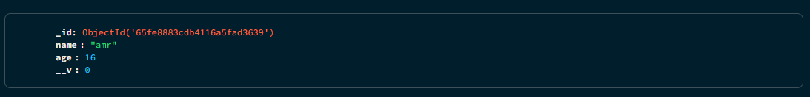

# Schemas and models:

`Schemas` allow you to define how the document in the db will look like, they allow you to set `types, default values, validators, etc...`

to create a schema use the schema constructor like:

```javascript
const usersSchema = new mongoose.Schema({
    name: {type: String, required: true, trim:true},
    age: {type: Number, required: true, min:1, max:100, validate: (v) => v > 1}
})
```

the:

- `type`: sets the type of the field,
- `required`: makes sure a value is present
- `min` and `max`: sets a range
- `validate`: uses a function to check for validity

to use this schema and create models based on it use the schema to create an object from it like:

```javascript
export const createDoc = async (name, age) => {
    try {
        const u1 =  new UserModel({
            name,
            age
        })

    const res = await u1.save()
    console.log(res)
    } catch (error) {
        console.error(error)
    }
}
```

then import this `createDoc` in the main js file and pass it the arguments it takes, for example:

```javascript
app.get("/:name/:age", (req,res) => {
    createDoc(req.params.name, req.params.age)
})
```

then if we for example used `http://localhost:8000/amr/10` i will see that in the db:


