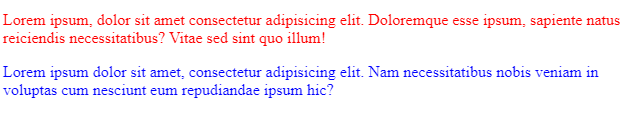

# Selectors

---

slector are used to target element within the html document so you can apply style to them

---

#### element selector:

```css
element
{
    /*your style here*/
}
```

an [**elementSelector**] is used to select all elements of the selelcted type in the page 
an example to an [**elementSelector**] will be like:

```css
p
{
    font-size: 10px;
}
```
> [!CAUTION]
> this selector has a low specificity.  

for example if you specifi another rule with higher spicificty this style wont work  
[**for any property the other rule has overridden**]

for example:

here we have to p elements first with no class and the second has one the general element selector will lose to the more specific class selector and the second p will be red

```html
<p>Lorem ipsum, dolor sit amet consectetur adipisicing elit. Doloremque esse ipsum, sapiente natus reiciendis necessitatibus? Vitae sed sint quo illum!</p>

<p class="class-1">Lorem ipsum dolor sit amet, consectetur adipisicing elit. Nam necessitatibus nobis veniam in voluptas cum nesciunt eum repudiandae ipsum hic?</p>

```

though the element selcetor is specifed under the class selcetor the p with the class will show blue 
```css
.class-1
{
    color: blue;
}
p
{
    color:red;
}
```
the result:


---
#### id and class selectors:
the id or the class selectors are the most common type of selectors used in css they target an element based on the value of the value of the class or id attribute

for example in the previous example we used the class slector [**.class-1**] to select the p tag with [**class = "class-1"**]

the id selector is the same but instead of using [ **.** ] before the class name we but [ **#** ]

```css
#id-name
{

}
```
> [!IMPORTANT]
> the id has higher spicificty than the class